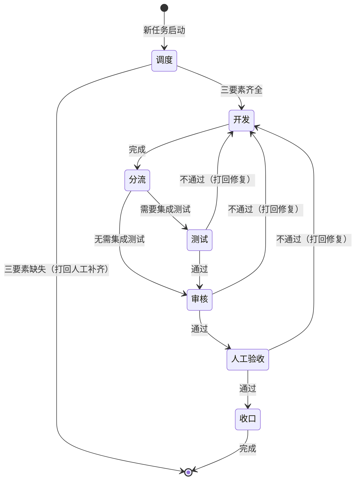

# 开发工作流 2.0 状态机说明

> 本文档面向新成员，用状态图与文字说明「开发工作流 2.0」的节点流转规则。阅读前建议先浏览《开发工作流 2.0 需求规格》了解整体背景。

---

## 1. 状态总览

工作流包含以下六个核心状态（节点）：

| 状态 | 说明 |
|------|------|
| **调度** | 以 GitHub issue 为输入，校验需求三要素（任务目标 / 涉及范围 / 验收标准），判定是否需要集成测试 |
| **开发** | 独立分支、测试驱动实现，满足质量闸门，产出 dev-report.md |
| **测试** | 执行单元测试与集成测试，证据驱动判定，产出 test-report.md |
| **审核** | 独立双轴审查（需求符合性 + 代码质量），产出 review-report.md |
| **人工验收** | 汇总审核/测试证据，产出通俗验收报告，**等待人工确认**通过/不通过 |
| **收口** | 合并前一致性收口、交接产物汇总、临时工作区清理 |

---

## 2. 状态流转图



---

## 3. 两条主分支

根据调度节点对「是否需要集成测试」的判定，工作流分为两条分支：

- **需集成测试分支**：`调度 → 开发 → 测试 → 审核 → 人工验收 → 收口`
- **无需集成测试分支**：`调度 → 开发 → 审核 → 人工验收 → 收口`

> 集成测试判定依据：跨模块、外部依赖、多组件协作、回归风险高 → 需要；纯局部、单模块、静态/配置类 → 不需要。

---

## 4. 打回规则与轮次上限

### 4.1 什么情况下会打回开发？

以下三个环节的判定不通过时，均会打回「开发」节点重新修复：

| 来源环节 | 打回条件 | 说明 |
|----------|----------|------|
| **测试** | 测试未通过 | 单元测试或集成测试存在失败 |
| **审核** | 审核未通过 | 需求符合性或代码质量未达标 |
| **人工验收** | 人工确认不通过 | 唯一允许从验收环节打回的路径 |

### 4.2 打回上限 9 轮

- 测试/审核/人工验收不通过时，均会**打回开发**重新修复。
- 同一任务的修复轮次**上限为 9 轮**（工作流控制层 `max_attempts = 9`）。
- 达到 9 轮上限后，任务判定为失败并保留运行记录；需由**人工重新调度**或**拆分任务**后继续。
- 重新调度时，调度节点会自动读取历史失败记录，在分析中给出「失败归因 + 拆分建议 + 人工介入建议」。

> ⚠️ **注意**：收口节点不因 AI 判定打回，正常完成即进入结束。

---

## 5. 人工验收为唯一人工门禁

- **人工验收独立成节点**：审核通过后先进入人工验收，验收通过才进入收口。
- **AI 不代签**：验收必须由人工确认，Agent 不能自批。等待人工确认是强制环节。
- **通俗验收报告**：accept 节点产出两份报告——通俗版 `acceptance-summary.md`（便于非技术人员理解）与严格版 `accept-report.md`。

---

## 6. 术语对照

本文档术语与《开发工作流 2.0 需求规格》保持一致：

| 本文档 | 需求规格文档 | 英文 ID |
|--------|--------------|---------|
| 调度 | 调度 | dispatcher |
| 开发 | 开发 | dev |
| 分流 | 分流 | route |
| 测试 | 测试 | test |
| 审核 | 审核 | review |
| 人工验收 | 人工验收 | accept |
| 收口 | 收口 | closeout |

---

## 7. 快速参考：一次完整的流转示例

```
[调度] 三要素齐全 → 需要集成测试
    ↓
[开发] 独立分支实现，本地验证全绿
    ↓
[测试] 运行单元测试 + 集成测试 → 通过
    ↓
[审核] 需求符合性 + 代码质量审查 → 通过
    ↓
[人工验收] 产出验收报告 → 人工确认通过
    ↓
[收口] 一致性对齐、产物汇总、清理临时工作区
    ↓
结束
```

若测试/审核/人工验收任一环节不通过，则沿对应打回边返回「开发」节点重新修复，计入轮次上限。
